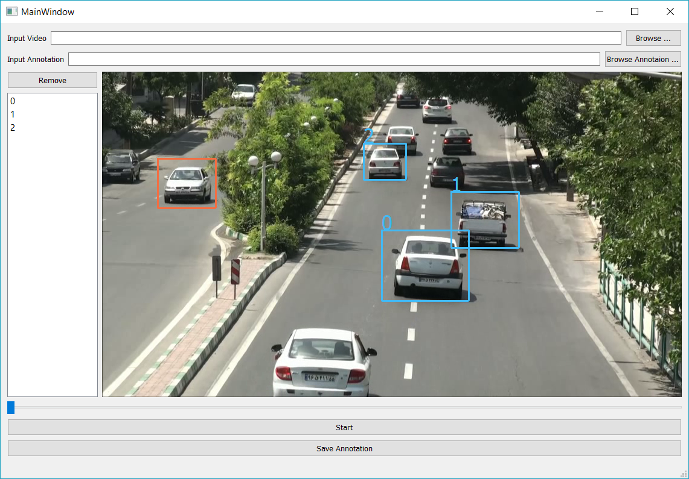

Semi-Automatic Object Tracking Annotation In Movie
==================================================

Description
-----------
Using this application you can annotate objects (e.g. cars) in video and the \
application automaticly tracks the annotated objects to exit from the frame

Dependacies
-----------
- OpenCV 3.1 (compiled with ffmpeg and contib)
- PyQt5
- Pandas
How to Install (Windows)
--------------
1- Install Anaconda 2.7 64bit

 - Download from here https://repo.continuum.io/archive/Anaconda2-4.4.0-Windows-x86_64.exe

2- Open Anaconda Prompt and Install opencv-contrib and pyqt and pandas

.. code-block:: python
    
    conda install pyqt
    pip install opencv-contrib-python
    conda install pandas

3- Install git and clone the repository

   Go to arbitrary directory and open a gitbash and clone the project

.. code-block::

    git clone https://github.com/alimirzaei/object-tracking --recursive

3- run the applicaion with following command

.. code-block:: python
    
    python app.py
If you had any question do not hesitate to contact :)

How to Install (Linux)
--------------
1- Open a terminal (Alt+Ctr+T) install git and clone the project

.. code-block:: 
    
    sudo apt-get install git
    git clone https://github.com/alimirzaei/object-tracking --recursive

2- Install pip and project dependencies

.. code-block:: python
    
    sudo apt-get install pip
    sudo pip install opencv-contrib-python
    sudo pip install pandas
    sudo pip install pyqt

2.5- To run your code faster you have to install the c++ compiler and comile some part of code:

.. code-block:: python
    
    sudo apt-get install build-essential
    cd object-tracking/KCFnb
    python fhog_utils.py
    
3- Run the applicaion with following command

.. code-block:: python

    cd object-tracking
    python app.py
   
If you had any question do not hesitate to contact :)

Screenshots
-----------

